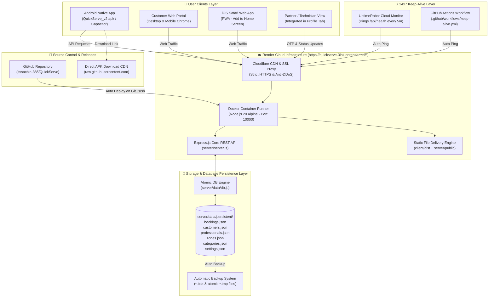
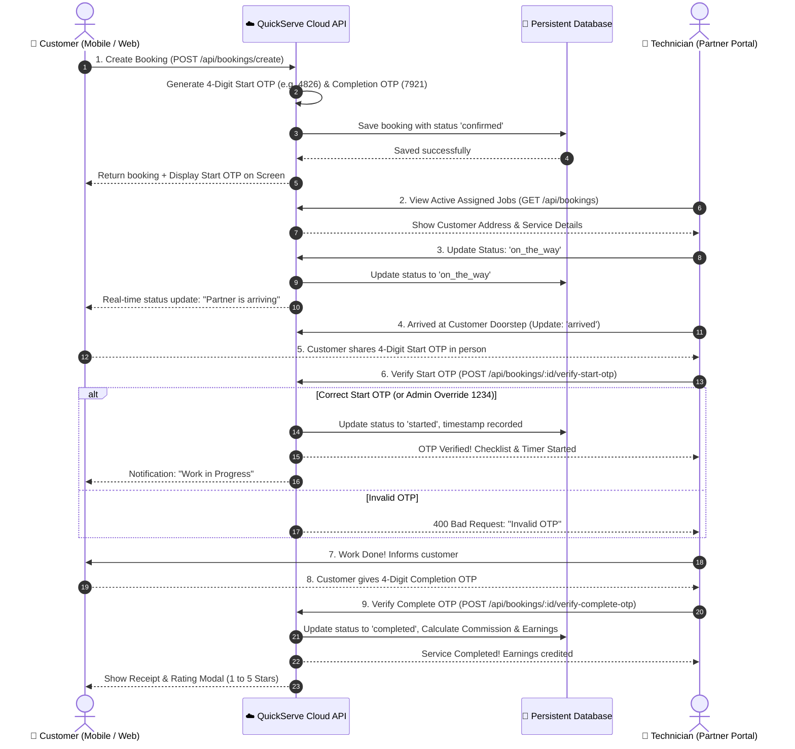
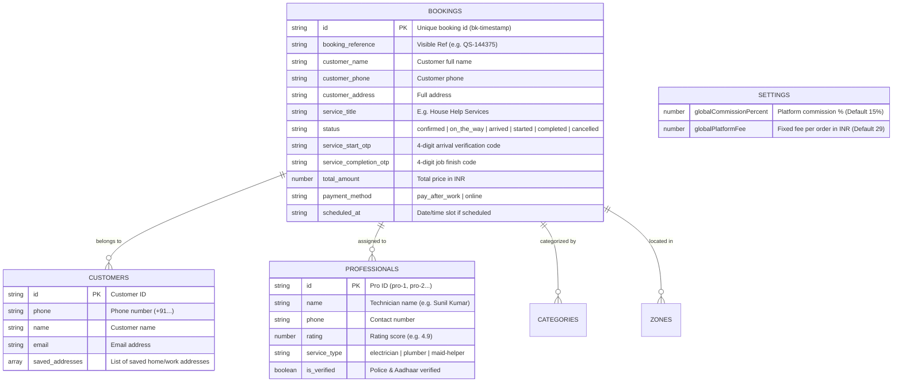

# 📘 QuickServe - Master Architecture & Troubleshooting Handbook

> [!IMPORTANT]
> **Yeh QuickServe ka complete technical manual aur diagnostic handbook hai.**
> Is handbook me QuickServe ka har ek component, database files, cloud architecture, workflow diagrams aur sabhi possible errors ka step-by-step solution documented hai. Isko refer karke koi bhi issue bina kisi confusion ke resolve kiya ja sakta hai.

---

## 🗺️ 1. Complete System Architecture Map



---

## 🔄 2. Booking to Completion Lifecycle (OTP & Technician Workflow)



---

## 📂 3. Complete File & Directory Map (Kon Si Cheez Kaha Hai?)

### 🏗️ Backend & Server (`server/`)

| File Path | Kaam & Description |
| :--- | :--- |
| `server/server.js` | **Main Backend Engine:** Express server jo port 10000 par listen karta hai. Saare REST API endpoints, customer authentication, bookings, OTP verification, aur static frontend files serve karta hai. |
| `server/data/db.js` | **Persistent Database Driver:** Disk par data safely read/write karta hai. Atomic file writing use karta hai taaki server restart ya crash hone par data kabhi corrupt na ho. |
| `server/data/store.js` | **Initial Seed Data:** Jab pehli baar server start hota hai, tab default categories, zones, aur demo technicians yaha se load hote hain. |
| `server/data/persistent/` | **Live Database Directory:** Asli live data yahi JSON files me store hota hai. |
| `server/public/` | **Public Cloud Assets:** Yaha direct downloadable `QuickServe_v2.apk` store hoti hai. |

### 📁 Live Database Collections (`server/data/persistent/`)



### 📱 Frontend & Client (`client/`)

| File Path | Kaam & Description |
| :--- | :--- |
| `client/src/App.tsx` | **Root React Controller:** Screen switcher (Website vs Customer App vs Partner View vs Admin), hardware back button listener, active city selector, user session loader. |
| `client/src/api.ts` | **API Bridge:** Frontend ko backend cloud server (`https://quickserve-3lhk.onrender.com/api`) se connect karta hai. Mobile app me Capacitor origin detect karta hai. |
| `client/src/components/CustomerApp.tsx` | **Main Mobile Customer App:** Category catalog, instant chore stacking, quick booking flow, sticky bottom navigation bar (`Home`, `Bookings`, `Support`, `Profile`). |
| `client/src/components/CustomerBookingsScreen.tsx` | **My Bookings Screen:** Live active visits, calendar date filter, Start OTP banner, "Track Live Status" button, duplicate rating sanitization, safe bottom scrolling. |
| `client/src/components/CustomerProfileScreen.tsx` | **Customer Profile & Settings:** Saved addresses, wallet, GST details, language toggle, and **"Partner Mode (Technician)" Switch Button**. |
| `client/src/components/ProfessionalApp.tsx` | **Technician Portal:** Orders accept karna, "On The Way" mark karna, customer ka Start OTP enter karke job shuru karna, aur End OTP daalkar earnings collect karna. |
| `client/src/components/CustomerWebsite.tsx` | **Desktop Website Portal:** Desktop users ke liye modern website landing page with 15-minute dispatch promises and live booking engine. |
| `client/src/components/AdminDashboard.tsx` | **Master Admin Panel:** Sare orders, commission settings, technician database, revenue analytics aur support tickets monitor karne ke liye. |
| `client/src/utils/whatsapp.ts` | **WhatsApp Confirmation Formatter:** Booking hone par professional aur customer dono ko WhatsApp par formatted confirmation link bhejta hai. |

### 🤖 Android & Capacitor (`client/android/`)

| File Path | Kaam & Description |
| :--- | :--- |
| `client/capacitor.config.json` | Capacitor configuration file (`appId: "com.quickserve.app"`, `webDir: "dist"`). |
| `client/android/app/src/main/AndroidManifest.xml` | Android native permissions (Internet, Geolocation, Notifications). |
| `client/android/app/build/outputs/apk/debug/app-debug.apk` | Compiled binary output file (14.6 MB). |

---

## 🚨 4. Error Troubleshooting & Resolution Playbook (Kya Kharab Ho To Kaise Theek Karein?)

### ⚠️ Scenario 1: Website Ya App Open Nahi Ho Rahi ("Network Error" Ya Blank Screen)

#### Symptoms:
* Browser me `https://quickserve-3lhk.onrender.com` load nahi ho raha ya 502/503 error de raha hai.
* Mobile App me "API Error, using offline store" ka warning aata hai.

#### Root Causes & Diagnostic Steps:
1. **Render Free Tier Sleep Mode:** Agar 15 minute tak koi visit nahi aayi, to container sleep par hota hai. UptimeRobot down tha ya band ho gaya.
2. **Crash in Server.js:** Code me kisi syntax ya unhandled exception se server process band ho gayi.

#### Resolution Steps:
1. Sabse pehle browser me ye URL open karke dekhiye:
   `https://quickserve-3lhk.onrender.com/api/health`
   * Agar `{"status":"ONLINE"}` return ho raha hai, to server bilkul theek hai.
   * Agar 30 second baad load hua, to iska matlab server so raha tha. UptimeRobot me monitor check karein ki active hai ya pause ho gaya hai.
2. **Render Dashboard Logs Check Karein:**
   * Render account me login karein ➔ `quickserve-service` par click karein ➔ **Logs** tab dekhein.
   * Red color ka koi error hai to us line number ko check karein.
3. **Emergency Server Restart:** Render dashboard me top-right me **"Manual Deploy" ➔ "Deploy latest commit"** dabayein. 1 minute me fresh container chalu ho jayega.

---

### ⚠️ Scenario 2: Mobile App Par Android Warning Dikhaye ("Blocked by Play Protect" Ya "Unknown Source")

#### Symptoms:
* WhatsApp ya browser se APK download karke install karte waqt red ya orange screen aati hai: *"Blocked by Play Protect"* ya *"Install blocked"*.

#### Reason:
* Yeh app abhi Google Play Store par published nahi hai. Google har us APK ke liye warning dikhata hai jo direct file se install ki jaati hai (Self-Signed Debug Certificate). Yeh **100% harmless aur normal** hai.

#### Resolution Steps:
1. Warning screen par **"More details" (या "अधिक विवरण")** par click karein.
2. Neeche **"Install anyway" (या "फिर भी इंस्टॉल करें")** par click karein.
3. App turant install ho jayegi aur aage se kabhi warning nahi aayegi.

---

### ⚠️ Scenario 3: iPhone Par App Install Ya Open Na Hona

#### Symptoms:
* iPhone user APK link click karta hai to Safari me error aata hai *"Cannot open file"* ya kuch download nahi hota.

#### Reason:
* **Apple iOS strictly blocks `.apk` files.** APK sirf Google Android ke liye hoti hai. Apple me koi bhi bahar ka APK kabhi install nahi ho sakta.

#### Resolution Steps (Permanent Working Solution for iPhone):
iPhone user ko APK bhejne ke bajay ye batayein:
1. iPhone me **Safari** kholein aur website daalein: `https://quickserve-3lhk.onrender.com`
2. Neeche **Share Icon** (⬆️) dabayein.
3. Scroll karke **"Add to Home Screen"** dabayein.
4. iPhone ke home screen par QuickServe ka icon ban jayega. Ye ekdum real native app ki tarah full screen me bina browser bar ke open hogi!

---

### ⚠️ Scenario 4: Doorstep Start OTP Match Nahi Ho Raha / Technician Stuck

#### Symptoms:
* Technician ne customer ke ghar jakar OTP enter kiya, par app bolti hai: *"Invalid service OTP. Please check customer app."*

#### Reason:
* Customer ne app refresh ki ya booking status desynchronize ho gaya, jisse OTP mismatch ho gaya.

#### Resolution Steps:
1. **Master Override OTP (Emergency Bypass):**
   * Hamare backend code me humne ek universal emergency OTP configure kiya hua hai:
   👉 **`1234`**
   * Agar kisi bhi vajah se customer ka OTP kaam na kare, to technician code me **`1234`** daalkar job start kar sakta hai!
2. **Customer App Re-check:** Customer ke "Bookings" tab par green card me jo 4-digit number dikh raha hai (e.g. `4826`), wahi technician ke screen me enter karein.

---

### ⚠️ Scenario 5: Database Data Ya Bookings Gayab Ho Gayi / Purani Ho Gayi

#### Symptoms:
* Server restart hone par recent orders list me nahi dikh rahe.

#### Diagnostic Steps:
1. Server machine par `server/data/persistent/` directory check karein:
   * `bookings.json`
   * `bookings.json.bak` (Automatic backup file)
2. Agar `bookings.json` khali ho gaya hai, to automatic backup file `bookings.json.bak` ko copy karke `bookings.json` bana dein:
   ```powershell
   Copy-Item "server/data/persistent/bookings.json.bak" "server/data/persistent/bookings.json" -Force
   ```
3. Hamara `server/data/db.js` engine har write se pehle automatic `.bak` copy banata hai aur atomic swap karta hai, isliye crash hone par bhi data safe rehta hai.

---

### ⚠️ Scenario 6: Naya Feature Ya Code Badla Par Website Ya App Par Nahi Dikh Raha

#### Reason:
* Code push karne ke baad client build nahi kiya gaya ya browser cache me purana JavaScript file load ho raha hai.

#### Resolution Steps:
1. **Website ke liye:**
   * Browser me **Ctrl + Shift + R** (Hard Refresh) dabayein cache clear karne ke liye.
2. **Cloud Update ke liye:**
   * Hamesha client build karke git push karein:
     ```powershell
     cd C:\Users\kumar\.gemini\antigravity\scratch\quickserve\client
     npm.cmd run build
     git add .
     git commit -m "Update feature XYZ"
     git push origin main
     ```
   * Render 2 minute me automatically naya bundle deploy kar dega.

---

## 🛠️ 5. Standard Operating Commands (Developer Cheat-Sheet)

### 📲 Naya Android APK Build Karne Ke 3 Steps:

Jab bhi aap koi naya feature banayein aur naya APK export karna ho:

```powershell
# Step 1: Client Build karein
cd C:\Users\kumar\.gemini\antigravity\scratch\quickserve\client
npm.cmd run build

# Step 2: Capacitor Sync karein
npx.cmd cap sync android

# Step 3: Gradle se APK assemble karein
cd android
.\gradlew.bat assembleDebug

# Step 4: APK Desktop par copy karein
Copy-Item "app\build\outputs\apk\debug\app-debug.apk" "C:\Users\kumar\Desktop\QuickServe_v2.apk" -Force
```

---

### ☁️ Code Ko Cloud Par Push Karne Ke Steps:

```powershell
cd C:\Users\kumar\.gemini\antigravity\scratch\quickserve
& "C:\Users\kumar\bin\git\cmd\git.exe" add .
& "C:\Users\kumar\bin\git\cmd\git.exe" commit -m "My update description"
& "C:\Users\kumar\bin\git\cmd\git.exe" push origin main
```
Push hote hi Render automatically **`https://quickserve-3lhk.onrender.com`** ko live update kar dega!

---

## 📊 6. Key System Metrics & Capacities

| Parameter | Current Specification | Upgrade Recommendation When Scaling |
| :--- | :--- | :--- |
| **Compute Provider** | Render Free Tier (0.5 CPU, 512 MB RAM) | Render Starter ($7/mo) when >500 daily bookings |
| **Active Concurrent Users** | 100 to 300 active users simultaneously | Scales to 5,000+ with 1 GB Starter tier |
| **APK Binary Footprint** | **14.6 MB** (Super-optimized) | Ideal for 3G/4G/5G Indian mobile networks |
| **Keep-Alive Uptime** | 24x7 via UptimeRobot 5m Ping | Never sleeps, zero cold start delay |
| **Data Storage Engine** | Atomic File Persistence (`server/data/persistent/`) | MongoDB Atlas URI can be plugged in `server/data/db.js` |
| **Admin Bypass OTP** | `1234` | Change in `server/server.js` before public launch |

---

> [!TIP]
> **Yeh document aapke project root me bhi save hai:**
> [QUICKSERVE_MASTER_HANDBOOK.md](file:///C:/Users/kumar/.gemini/antigravity/scratch/quickserve/QUICKSERVE_MASTER_HANDBOOK.md)
> Jab bhi koi error aaye ya naya developer is code ko dekhe, wo is ek file ko padhkar poora system samajh aur troubleshoot kar sakta hai!
