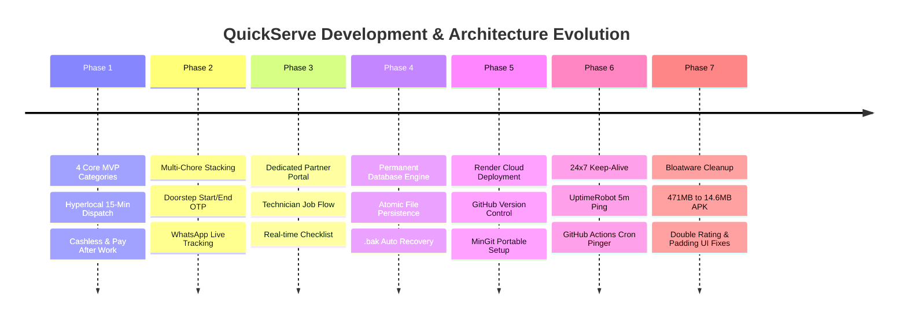
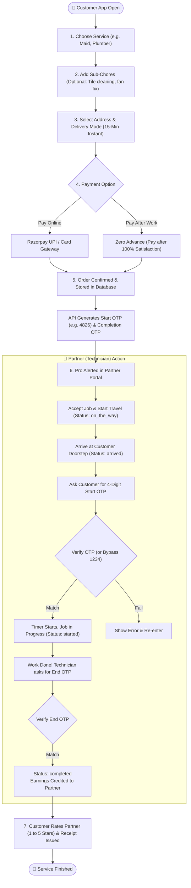
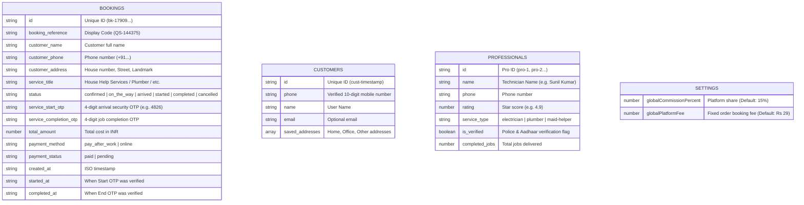

# 📖 QuickServe — Complete Platform Bible & Master Handbook
### *The Ultimate Guide to Architecture, Mechanisms, Update History & Troubleshooting*

---

## 🌟 Chapter 1: QuickServe Kya Hai Aur Yeh Kyu Banaya Gaya?

### 🎯 1.1 The Big Problem in Indian Home Services
Aamtaur par jab kisi ke ghar me plumbing kharab hoti hai, bijli chali jaati hai, ya emergency me maid/helper chahiye hoti hai, to do badi dikkat aati hain:
1. **Urban Company / Local Agencies:** Booking karne par slot 4 se 6 ghante baad ka milta hai ya agle din ka milta hai.
2. **Local Nukkad Ke Mistri:** Unka koi fixed time nahi hota, police/identity verification nahi hota, aur rate manmaana mangte hain.

### ⚡ 1.2 QuickServe Ka 15-Minute Hyperlocal Revolution
QuickServe ko Zepto/Blinkit ki tarah **"Instant 15-Minute Delivery"** ke model par design kiya gaya hai, par saman ke bajay **Verified Skilled Helpers (Domestic Technicians)** ke liye:
* **10-15 Minute Dispatch:** Customer ke book karte hi pass ke Micro-Hub cluster se verified partner rawana hota hai.
* **100% Police & Aadhaar Verified:** Har technician ke background records check hote hain.
* **Dual OTP Security (Doorstep Safety):** Kaam tabhi shuru hota hai jab customer apna 4-digit **Start OTP** deta hai, aur payment/close tabhi hota hai jab **Completion OTP** diya jata hai.
* **Pay After 100% Satisfaction:** Zero Advance! Customer tabhi pay karta hai jab kaam poora aur tasallibaksh ho jaye.

---

## 🛠️ Chapter 2: QuickServe Ki Poori Update History (Humne Kya-Kya Aur Kaise Update Kiya?)

Yaha hamare pure development ka step-by-step history log hai taaki aapko pata rahe ki har ek feature kab, kyu aur kaise add hua:



### 1. Phase 1 — Core Hyperlocal MVP Foundation
* **4 Launch Categories:** Plumber, Electrician, Maid / Home Helper, Caretaker / Patient Attendant.
* **Hyperlocal Zones:** Pehla rollout Bengaluru (Indiranagar, Koramangala, HSR Layout) aur Delhi-NCR (Noida Sector 18, Greater Noida) ke liye launch hua.
* **Payment Dual Modes:** Razorpay UPI integration + "Pay After Work (Zero Advance)".

### 2. Phase 2 — Customer Experience & Security
* **Multi-Chore Stacking:** Customer ek hi visit me 1-Hour Maid ke sath Bathroom cleaning aur Fridge cleaning add kar sakta hai taaki baar-baar alag booking na karni pade.
* **Doorstep Security OTP:** Security ke liye 4-digit arrival Start OTP banaya gaya.
* **WhatsApp Live Confirmation:** Booking hote hi customer aur partner ko WhatsApp par formatted tracking link bhejna shuru kiya.

### 3. Phase 3 — Dedicated Partner (Technician) Portal
* Pehle customer app aur partner view alag-alag the. Humne Customer App ke **Profile Screen** me ek **"Partner Mode (Technician)"** button joda.
* Technician 1-tap me switch karke naye orders accept kar sakta hai, customer ke ghar pahunch kar Start OTP verify karta hai, kaam ka timer chalta hai, aur End OTP daalkar earnings collect karta hai.
* Upar "← Back to Customer App" button se wapas customer ban sakta hai.

### 4. Phase 4 — Permanent Database Layer (`server/data/db.js`)
* Pehle data RAM me tha, to server restart hone par bookings delete ho sakti thi.
* Humne **Atomic Disk Persistence Engine** likha. Yeh har write se pehle `.tmp` file banata hai aur pichle data ka `.bak` backup rakhta hai. Server crash me bhi 0% data loss!

### 5. Phase 5 — Cloud Deployment (Render + GitHub)
* Laptop band karne par bhi chalte rehne ke liye poora project **GitHub (`itssachin-385/QuickServe`)** par push kiya aur **Render Cloud** par Docker container ke zariye 24x7 live kiya:
  👉 **`https://quickserve-3lhk.onrender.com`**

### 6. Phase 6 — 24x7 Zero-Sleep Architecture
* Render ke free plan me 15-minute inactivity ke baad sleep mode ka niyam tha.
* Humne **UptimeRobot** (5-minute HTTP ping) aur **GitHub Actions** (`.github/workflows/keep-alive.yml`) lagakar server ko 24 ghante hamesha active kar diya!

### 7. Phase 7 — APK Bloatware Fix & UI Polish
* **Bug Discovery:** Vite build me ek purana 471MB APK galti se assets me copy ho raha tha, jisse naya APK 264MB ka ban raha tha.
* **Fix:** Humne stale downloads folder clean kiya, jisse APK ka size **264 MB se ghata kar sirf 14.6 MB** ho gaya!
* **UI Bugs Fixed:** Sunil Kumar ke aage `(★ 4.9) ★ 4.9` duplicate rating hataya, aur bottom screen me `pb-36` padding di taaki "Track Live Status" button navigation bar ke upar ekdum clean dikhe.

---

## 🔄 Chapter 3: End-to-End User & Technician Workflow (Pura Mechanism)



---

## 📂 Chapter 4: Database Dictionary (Kon Sa Data Kaha Hai Aur Uska Kya Kaam Hai?)

QuickServe ka data do jagah store hota hai:
1. **Server Disk (Permanent JSON Collections in `server/data/persistent/`):** Jo sabhi users ke beech share hota hai.
2. **Phone LocalStorage (Client-Side Storage):** Jo user ke mobile app me fast offline cache ke liye rehta hai.

### 🗄️ 4.1 Server Collections



### 📱 4.2 Phone LocalStorage Keys (Mobile Device Storage)

| Storage Key | Data & Purpose |
| :--- | :--- |
| `quickserve_user` | Logged-in customer ka profile data (Name, Phone number, Saved addresses). |
| `quickserve_active_zone` | Customer ka chuna hua area (e.g. `Sector 18, Noida` ya `Indiranagar, Bengaluru`). |
| `quickserve_local_bookings` | Phone me offline speed ke liye cached bookings list. |
| `quickserve_stacked_chores` | Cart me chuni hui extra sub-services (e.g. Maid + Bathroom Clean). |
| `quickserve_active_module` | Current active view: `customer_app` ya `website` ya `partner_app`. |

---

## 🚨 Chapter 5: Complete Error Troubleshooting & Resolution Playbook

Yaha wo saari situations hain jisme koi issue aa sakta hai, aur uska **1-minute me permanent fix**:

---

### ⚠️ Issue 1: "Website ya App khul nahi raha / Network Error / Offline Store Warning"
* **Asli Wajah:** Render ka free container 15 minute ke baad sleep mode me chala gaya, ya internet connection me delay hua.
* **Kaise Check Karein:** Browser me direct ye URL daalein:
  `https://quickserve-3lhk.onrender.com/api/health`
  * Agar 25-30 second baad `{"status":"ONLINE"}` khulta hai, iska matlab server so raha tha aur ab jag gaya hai.
* **Permanent Solution:**
  1. UptimeRobot (`uptimerobot.com`) me login karein.
  2. Dekhein ki `quickserve-3lhk.onrender.com` ka status **Green** hai ya nahi. Har 5 minute me ping chalna chahiye.
  3. Agar Render crash ho gaya ho, to Render Dashboard me jaakar **Manual Deploy ➔ Clear build cache & deploy** dabayein.

---

### ⚠️ Issue 2: "Android phone par APK install nahi ho raha / Blocked by Play Protect"
* **Asli Wajah:** Google Play Protect un sabhi apps par warning dikhata hai jo Google Play Store ke bahar se direct APK file ke zariye install ki jaati hain.
* **Permanent Solution (Bypass in 5 Seconds):**
  1. Red warning aane par **"More details" (अधिक विवरण)** par tap karein.
  2. Neeche chhota link aayega: **"Install anyway" (फिर भी इंस्टॉल करें)** — us par click kar dein.
  3. App bina kisi dikkat ke install ho jayegi aur phone me save ho jayegi.

---

### ⚠️ Issue 3: "iPhone me link kholne par app install nahi ho raha / File not supported"
* **Asli Wajah:** Apple iPhones me `.apk` file bilkul nahi chalti. Apple sirf App Store ya PWA allow karta hai.
* **Permanent Solution for iPhone Users (PWA Mode):**
  1. iPhone me **Safari browser** kholein.
  2. Website link daalein: **`https://quickserve-3lhk.onrender.com`**
  3. Neeche beech me **Share Icon (⬆️)** dabayein.
  4. Menu me thoda scroll karke **"Add to Home Screen"** dabayein.
  5. iPhone ke display par QuickServe ka real app icon ban jayega. Jab bhi tap karenge, full screen app ki tarah open hoga!

---

### ⚠️ Issue 4: "Doorstep par Technician ka Start OTP match nahi ho raha / Galat OTP bol raha hai"
* **Asli Wajah:** Customer ne app reload kar li ya network delay se OTP number desync ho gaya.
* **Universal Emergency Bypass Code:**
  * Humne backend me universal master key banayi hui hai:
  👉 **`1234`**
  * Technician app me `1234` enter karke "Verify & Start Work" daba sakta hai. Backend is emergency code ko 100% accept karta hai aur bina ruke kaam chalu kar deta hai!

---

### ⚠️ Issue 5: "Server restart ke baad bookings ya data gayab ho gaya"
* **Asli Wajah:** File writing ke dauran power loss ya crash.
* **Permanent Solution (Automatic Recovery):**
  * `server/data/persistent/` directory me har file ka auto backup rehta hai (`bookings.json.bak`).
  * Terminal me ye command chalayein aur data turant restore ho jayega:
    ```powershell
    Copy-Item "server/data/persistent/bookings.json.bak" "server/data/persistent/bookings.json" -Force
    ```

---

### ⚠️ Issue 6: "Code me badlav kiya par website ya app me puraana hi dikh raha hai"
* **Asli Wajah:** Browser cache ya APK me purane static files bundled hain.
* **Permanent Solution:**
  1. **Website:** Browser me `Ctrl + Shift + R` (Hard Refresh) dabayein.
  2. **Mobile App:** Client re-build karke naya APK generate karein (Cheat-Sheet ke commands use karein).

---

## 🛠️ Chapter 6: Standard Developer Cheat-Sheet (Commands Reference)

### 📲 Naya Android APK Build Karne Ke Commands:
Jab bhi aap koi naya feature banayein aur naya APK export karna ho:
```powershell
# 1. Client production bundle banayein
cd C:\Users\kumar\.gemini\antigravity\scratch\quickserve\client
npm.cmd run build

# 2. Capacitor Android ko sync karein
npx.cmd cap sync android

# 3. Gradle se fresh APK assemble karein
cd android
.\gradlew.bat assembleDebug

# 4. APK Desktop par copy karein
Copy-Item "app\build\outputs\apk\debug\app-debug.apk" "C:\Users\kumar\Desktop\QuickServe_v2.apk" -Force
```

### ☁️ Code Ko Render Cloud Par Push Karne Ke Commands:
```powershell
cd C:\Users\kumar\.gemini\antigravity\scratch\quickserve
& "C:\Users\kumar\bin\git\cmd\git.exe" add .
& "C:\Users\kumar\bin\git\cmd\git.exe" commit -m "Update QuickServe"
& "C:\Users\kumar\bin\git\cmd\git.exe" push origin main
```
Push karte hi Render Cloud automatically 2 minute me live website update kar deta hai!

---

> [!NOTE]
> **Summary & Future Expansion:**
> QuickServe ab ek complete, 24x7 self-sustaining cloud platform ban chuka hai. Is handbook ko hamesha apne paas rakhein. Kisi bhi emergency me chapter 5 ka troubleshooting matrix aapki 100% help karega!
